# Venta Wild-Roster Draft — who lives where? 🗺️

> **PROPOSED — this is Lewis's homework B37, not a decision.** Every wild
> Fakeamon in the pool has been dealt a *draft* home area, matched to the
> six area vibes he invented (B8) and each creature's type, look, and blurb.
> **There are no wrong answers** — to move someone, just tell Claude
> ("the crocodiles go to Snow Mountain!") or scribble on a printout. When
> Lewis signs off (or reshuffles), the picks get logged in `DECISIONS.md`
> and `tools/roster-200.json` is updated to match.
>
> Rules baked into the draft: **evolution lines stay together** (all stages
> share an area — the basic stage is common, evolved stages rarer), levels
> follow B4 (early areas easy, far areas dangerous — ranges below are
> Jeff-tunable `[TUNE]` drafts), and the three ⚠️ OPMon-derived monsters
> are placed but stay out of the game until their license is confirmed.
> Wild-level ranges assume the badge order from B14: Gear → The Lagoon,
> Flame → The Factory, Wet → Snow Mountain.
>
> Names: the slugs below are Tuxemon working IDs. **Lewis invents every
> player-facing name** — that's the rename pass, done area by area as each
> area gets built.

## The Meadows — *grassland — the starting area*

**Wild levels 2–5 `[TUNE]` · 14 evolution lines · 29 Fakeamon**

| Art | Evolution line | Type (proposed) | Why they live here |
|---|---|---|---|
| 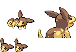 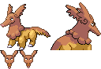 | `aardorn` → `aardart` | normal | born in an anthill, digs through grassland all day |
| 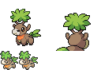 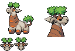 | `baoby` → `baobaraffe` | grass | a baby baobab that grows into a giraffe-tree — savanna vibes |
| 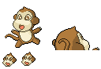 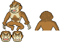 | `capiti` → `capinyah` | normal | friendly little field spirits near the villages |
| 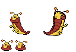 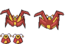 | `chenipode` → `exapode` | normal | the classic first bug — it bites onto your shoelaces |
| 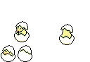 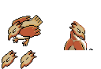 | `chickadee` → `birdee` | normal | small songbirds for the first fields |
| 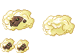 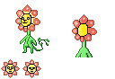 | `dandicub` → `dandylion` | grass | a lion cub made of dandelions — literally a meadow |
| 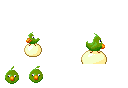 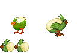 | `hatchling` → `birdling` | normal | a baby bird learning to fly over open grass |
| 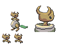 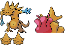 | `lambert` → `legko` → `moloch` | grass | a lamb! meadows need a farm animal |
| 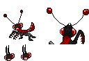 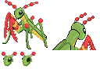 | `marvillar` → `marvantis` | normal | a grub that grows into a mantis — field insect life |
| 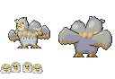 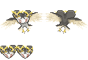 | `pairagrin` → `pairagrim` | normal | paired birds circling above the grass |
| 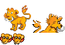 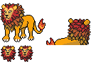 | `pantherafira` → `criniotherme` | fire | the Meadows' one scary line — a fire lion prowling the grass |
| 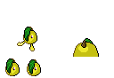 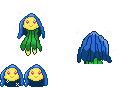 | `shybulb` → `narcileaf` | grass | a shy flower hiding in the grass |
| 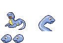 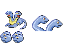 | `snaki` → `snokari` | normal | grass snakes sunning on the path |
| 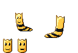 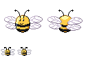 | `tumbleworm` → `tumblebee` | grass | a worm that tumbles through fields and becomes a bee |

## The Forest — *trees — Banvengeance's home (night)*

**Wild levels 4–8 `[TUNE]` · 15 evolution lines · 38 Fakeamon**

| Art | Evolution line | Type (proposed) | Why they live here |
|---|---|---|---|
| 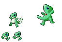 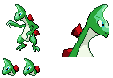 | `anoleaf` → `gectile` → `velocitile` | grass | leaf lizards camouflaged on trunks |
| 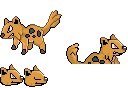 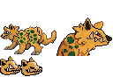 | `babysnitch` → `baddrscratch` | grass | sneaky shadow-hunters of the undergrowth |
| 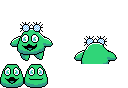 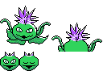 | `burrlock` → `cacaburr` | grass | burr seeds that stick to you on the forest floor |
| 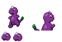 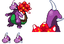 | `chloragon` → `sapragon` → `dragarbor` | grass | dragons that grow into whole trees |
| 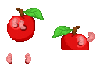 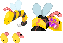 | `duggot` → `breem` | grass | a wood-worm that becomes a forest bee |
| 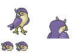 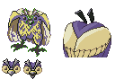 | `flacono` → `corvix` → `gryfix` | normal | birds of prey nesting in the high canopy |
| 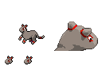 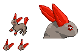 | `flounce` → `knindling` | fire | a fiery little night-hunter |
| 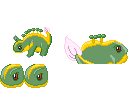 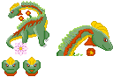 | `fordin` → `stegofor` → `brachifor` | grass | tree-dinosaurs — walking bits of forest |
| 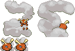 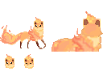 | `foxfire` → `vulpyre` | fire | fire foxes glowing between the trees at night |
| 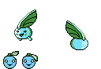 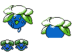 | `helipi` → `coppi` → `parappi` | grass | helicopter seeds spinning down from the canopy |
| 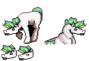 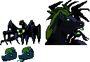 | `hoarse` → `equill` → `hoarseshoo` | grass | a spooky runaway farm animal hiding in the dark woods |
|   | `noctula` → `noctalo` | normal | bats for the forest night (mini-bosses come out at night too!) |
|   | `scarlant` → `shull` → `myrmison` | grass | armored ants with anthill fortresses |
|   | `selket` → `selmatek` | grass | venomous scuttlers under the leaf litter |
|   | `vamporm` → `dracune` → `fluttaflap` | normal | it drinks tree sap — the blurb says so! |

## Foggy City — *packed urban city, thick with fog*

**Wild levels 7–12 `[TUNE]` · 15 evolution lines · 32 Fakeamon**

| Art | Evolution line | Type (proposed) | Why they live here |
|---|---|---|---|
|   | `bumbulus` → `nimbulex` | metal | storm clouds tangled between the rooftops — the fog itself |
|   | `cackleen` → `brumi` → `bewhich` | normal | a ghost girl drifting through the fog |
|   | `cairfrey` → `possessun` | normal | possessed furniture in abandoned buildings |
|   | `elofly` → `elowind` → `elostorm` | normal | wind spirits funneling down the alleys |
|   | `eyenemy` → `eyesore` | normal | it feeds on spectacular sights — the city lights |
|   | `fuzzlet` → `fuzzina` | normal | cosmic dust bunnies breeding under the streetlights |
|   | `hoodoll` → `wolololl` | grass | creepy dolls from the occult corner shop |
|   | `imbrickcile` → `bricgard` → `brickhemoth` | grass | the city's old brick walls got up and started walking |
|   | `komodraw` → `komoduel` | normal | street duelists challenging passers-by |
|   | `pickoon` → `raccscal` | normal | trash-panda rascals raiding the bins |
|  | `pigabyte` | metal | a half-organic computer loose in the streets |
|   | `pipis` → `strella` | normal | city pigeons whose cries are a bad omen in the fog |
|   | `potturmeist` → `potturney` | grass | haunted pottery from the old shops |
|   | `tetrchimp` → `apeoro` | metal | an arcade-block chimp — very video-game, very city |
|   | `woodoor` → `blasdoor` | metal | living doors — a city is FULL of doors |

## The Lagoon — *swamp — opens with the Gear Badge; home of Saurchin, Sharpfin & Tobishimi (night)*

**Wild levels 10–15 `[TUNE]` · 12 evolution lines · 29 Fakeamon**

| Art | Evolution line | Type (proposed) | Why they live here |
|---|---|---|---|
|   | `axolightl` → `ampystoma` | water | an electric axolotl — a real swamp salamander |
|   | `claymorior` → `regalance` | grass | clay knights sculpted from swamp mud |
|   | `fluoresfin` → `incandesfin` → `lightmare` | water | glowing anglerfish lighting the murk |
|   | `gupphish` → `gupphire` → `golnagi` | water | fire-water guppies steaming in the shallows |
|   | `jelillow` → `bedoo` | water | jellies bobbing in the shallows |
|   | `kroki` → `krokivip` → `leviadile` | water | venomous crocodiles — the swamp's flagship |
|   | `lesmagu` → `shelagu` → `crustagu` | water | armored snails crawling through the muck |
|   | `nebufin` → `galasces` → `novaquarius` | water | murky venom-fish of the deep pools |
|   | `nostray` → `shnark` | water | rays and sharks patrolling the channels |
|   | `nudiflot_female` → `nudimind` | water | dreamy sea-slugs (the mind-bending one) |
|   | `nudiflot_male` → `nudikill` | water | poison sea-slugs (the fierce one) |
|   | `skwib` → `octabode` | normal | a mud-dwelling octopus that builds its own abode |

## The Factory — *poisonous war zone — opens with the Flame Badge; Gastronium's home (night)*

**Wild levels 13–18 `[TUNE]` · 18 evolution lines · 39 Fakeamon**

| Art | Evolution line | Type (proposed) | Why they live here |
|---|---|---|---|
|  | `agnsher` | fire | a lab-made fusion of two creatures — what ARE they building here? |
|   | `boltnu` → `exclawvate` | metal | a metal beast that claws through scrap |
|   | `cardiling` → `cardiwing` → `cardinale` | fire | a firebird that hunts the Factory's SPRORM and melts them down — the blurbs say so! |
|   | `cataspike` → `puparmor` → `weavifly` | metal | armor-plated bugs nesting in the pipes |
|  | `chrome_robo` | metal | a hostile robot |
|  | `dark_robo` | metal | its meaner twin |
|   | `devidin` → `devidra` → `deviraptor` | fire | war-raptors bred for the battlefield |
|   | `embra` → `ruption` | fire | furnace blobs that eat everything to grow |
|   | `furnursus` → `statursus` → `coaldiak` | fire | furnace bears stoking their bellies with factory coal ⚠️ (final form Coaldiak is the OPMon-flagged one) |
|   | `grimachin` → `tigrock` | metal | a toy war-machine that was 'too dangerous' — perfect |
|  | `hydrone` | metal | experimental water-power tech |
|   | `ignibus` → `embazook` → `eruptibus` | fire | a walking bazooka — it IS the war zone |
|   | `nut` → `bolt` → `arthrobolt` | metal | living nuts & bolts — factory floor basics |
|   | `pythwire` → `ouroboutlet` → `sockeserp` | metal | wire snakes and living power outlets |
|   | `rosarin` → `toxiris` → `ninjasmine` | grass | the poison-flower ninja line — the 'poisonous' in poisonous war zone ⚠️ |
|   | `sprorm` → `sphake` | metal | little metal grubs the machines snack on |
|   | `virware` → `trojerror` | metal | computer viruses escaped into the machines |
|  | `xeon` | metal | a third hostile robot — the factory built too many |

## Snow Mountain — *icy, Everest-like peaks — opens with the Wet Badge; the final wild area*

**Wild levels 16–22 `[TUNE]` · 16 evolution lines · 31 Fakeamon**

| Art | Evolution line | Type (proposed) | Why they live here |
|---|---|---|---|
|   | `bursa` → `flambear` | fire | mountain bears burning with 'fire of the mind' |
|   | `caper` → `crankus` | normal | frost goats leaping between ledges |
|   | `chillimp` → `snowrilla` | water | the yeti line — every snow mountain needs one |
|   | `cohldrabi` → `lettice` → `frostuce` | grass | frozen cabbages of the high farms |
|  | `drokoro` | fire | catch rate 5?! an ultra-rare dragon at the very peak |
|   | `eskipup` → `houndice` | water | sled-dog puppies that pull one-ton loads |
|   | `flummby` → `flummack` | normal | aurora spirits dancing over the ice |
|   | `forturtle` → `prophetoise` | fire | oracle turtles reading the future at the summit shrine |
|   | `grintot` → `grinflare` → `grintrock` | metal | grinding boulders — the blurb says they're rocks shaped by erosion, like the mountain itself |
|   | `merlicun` → `firomenis` | metal | cosmic dragons — the peaks are closest to the stars |
|   | `metesaur` → `qetzlrokilus` | fire | METEOR dinosaurs — Artemis's meteor theme, foreshadowed! |
|  | `mingdyn` | fire | a fire-sky dragon riding the mountain winds |
|  | `primordia` | fire | fire-AND-frost ancestor of all — a near-legend of the peaks |
|   | `rockitten` → `rockat` → `jemuar` | grass | rock kittens with snuggly stone ears |
|  | `solight` | fire | a living aurora |
|   | `thumpurn` → `volconey` | fire | volcano rabbits warming themselves at the hot springs |

---

*Heads-up on two Factory robots: Tuxemon's own `chrome_robo` and
`dark_robo` sheets have unfinished back/idle frames (they're literally "?"
placeholders upstream) — their front poses are fine for battles, but they
can't stand on the map until that art exists or we swap them.*

*Each art cell shows the line's first and final form (front pose, back pose,
and the little map sprite are all on one sheet). Full stats, catch rates,
and description blurbs for every one of the 198: `tools/roster-200.json`.
Attribution: `CREDITS_ROSTER.md`. The three starters (Growler, Whaley,
Leafick) aren't in this pool — they're yours from the start.* 🌠